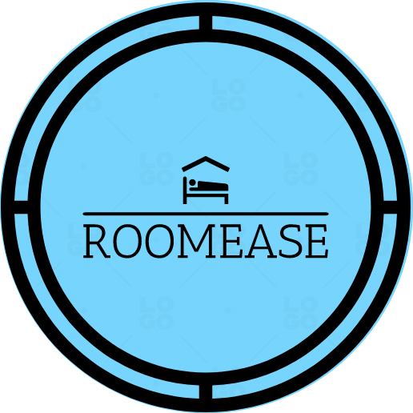

# RoomEase Documentation

## Table of Contents

1. [Introduction](#introduction)
2. [Getting Started](#getting-started)
   - [Prerequisites](#prerequisites)
   - [Installation](#installation)
3. [User Guide](#user-guide)
   - [Registration](#registration)
   - [Login](#login)
   - [User Dashboard](#user-dashboard)
     - [Browse Available Rooms](#browse-available-rooms)
     - [Booking a Room](#booking-a-room)
     - [Notifications](#notifications)
     - [Logging Out](#logging-out)
4. [Admin Guide](#admin-guide)
   - [Admin Dashboard](#admin-dashboard)
     - [Publishing a Room](#publishing-a-room)
     - [Managing Room Listings](#managing-room-listings)
     - [Notifications](#admin-notifications)
     - [Logging Out](#admin-logging-out)
5. [Technical Details](#technical-details)
   - [Technologies Used](#technologies-used)
   - [Database](#database)
6. [Conclusion](#conclusion)

---

## 1. Introduction 

Welcome to RoomEase, a web-based room booking and hosting platform. RoomEase allows users to either host rooms or book available rooms by providing their details. This documentation provides an overview of how to use RoomEase and the features available to both users and administrators.

## 2. Getting Started 

### Prerequisites 

Before using RoomEase, ensure that you have the following components installed:

- [XAMPP](https://www.apachefriends.org/index.html) for hosting the web application.
- [MySQL](https://www.mysql.com/) for database storage.
- A modern web browser such as Google Chrome or Mozilla Firefox.

### Installation 

1. Clone the RoomEase repository to your local machine.
2. Place the project files in the XAMPP `htdocs` directory.
3. Import the provided MySQL database dump into your MySQL server.
4. Configure the database connection in the project's PHP files if needed.

## 3. User Guide 

### Registration 

- Visit the RoomEase website and click on the "Register" button.
- Fill in the required details, including username, password, and contact information.
- Click the "Register" button to create your account.

### Login 

- After registration, you will be redirected to the login page.
- Enter your username and password.
- Click the "Login" button to access your account.

### User Dashboard 

#### Browse Available Rooms 

- Once logged in as a user, you will be directed to your dashboard.
- Browse through the list of available rooms.

#### Booking a Room 

- Click on a room card to view its details.
- Enter the necessary details for booking the specific room.
- Click the "Book" button to request the booking.

#### Notifications 

- The header section contains a notification button indicating the status of your booking requests.
- Click on the notification button to view your booking requests and their statuses.

#### Logging Out 

- To log out, click the "Logout" button in the header section.

## 4. Admin Guide 

### Admin Dashboard 

#### Publishing a Room 

- After logging in as an admin, access the admin dashboard.
- Publish a room by entering the necessary details.

#### Managing Room Listings 

- Admins can manage room listings, including editing or removing them.

#### Notifications 

- The header section contains a notification button for admin notifications, including booking requests.
- Admins can accept or reject booking requests based on user-provided details.

#### Logging Out 

- To log out as an admin, click the "Logout" button in the header section.

## 5. Technical Details 

### Technologies Used 

- PHP for server-side scripting.
- HTML for web page structure.
- JavaScript for interactive features.
- MySQL for database storage.

### Database 

- RoomEase uses MySQL to store user accounts, room details, and booking information.

## 6. Conclusion 

RoomEase is a versatile room booking and hosting platform that simplifies the process of finding and booking rooms. Whether you're a user looking for a room or an admin managing room listings, RoomEase provides a seamless experience for all users. For any technical issues or questions, please refer to the project's documentation or contact our support team. Enjoy using RoomEase!